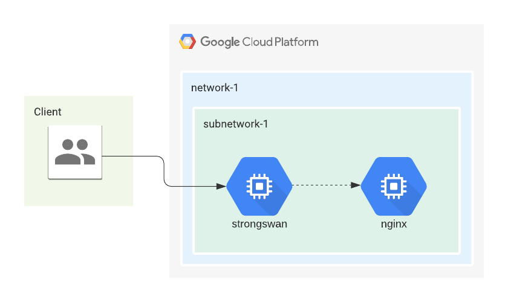

# Strongswan Roadwarrior Terraform

Example Terraform config to setup Strongwan server for [roadwarrior](https://github.com/strongswan/strongswan/tree/7ae4ced06f73dcb80a4c548b0b5f3754c2007826#roadwarrior-case) use cases.



The Nginx server shown in the picture above is not accesible from the 
public internet. Clients first need to establish an IPSec VPN connection with
the Strongswan server. Upon successful VPN connection, clients can access
the Nginx server from its internal IP address.

## Requirements

- [Terraform](https://www.terraform.io/downloads.html) v0.12

## Installation

Create `example.tfvars` according to your Google Cloud project and network.
```
project               = "gcp-project-id"
region                = "asia-southeast1"
zone                  = "asia-southeast1-a"
subnet_cidr_range     = "10.140.0.0/20"
virtualip_addresspool = "10.3.0.0/16"
hostname              = "moon.strongswan.org"
```

The example value above should work in general for a clean GCP project, only
the `project` value needs to be updated.

```bash
terraform init
terraform plan -var-file example.tfvars -out tfplan
terraform apply tfplan
```

## Client Connection

Clients will first need to download the CA Certificate generated by Strongswan.
Download `strongswanCert.pem` from the Strongswan server.

```bash
gcloud compute scp strongswan:/etc/swanctl/x509ca/strongswanCert.pem /tmp/strongswanCert.pem
```

Assuming the client has installed the `strongswan` package and have `charon-cmd`
command line available. Run the following to establish the VPN connection. Refer
to `main.tf` for the credentials that have been configured.

```bash
charon-cmd --cert /tmp/strongswanCert.pem --identity carol --host moon.strongswan.org
```

## Reference

https://github.com/strongswan/strongswan